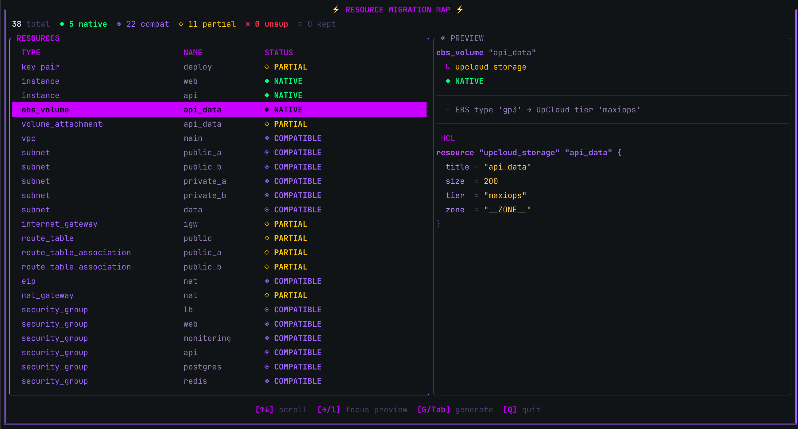
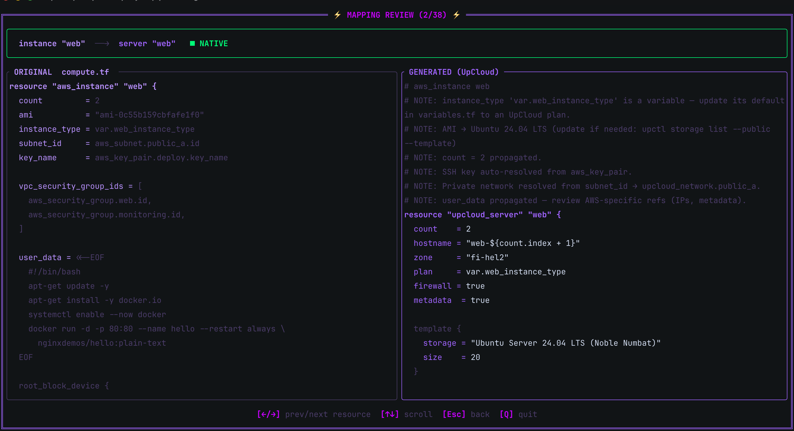
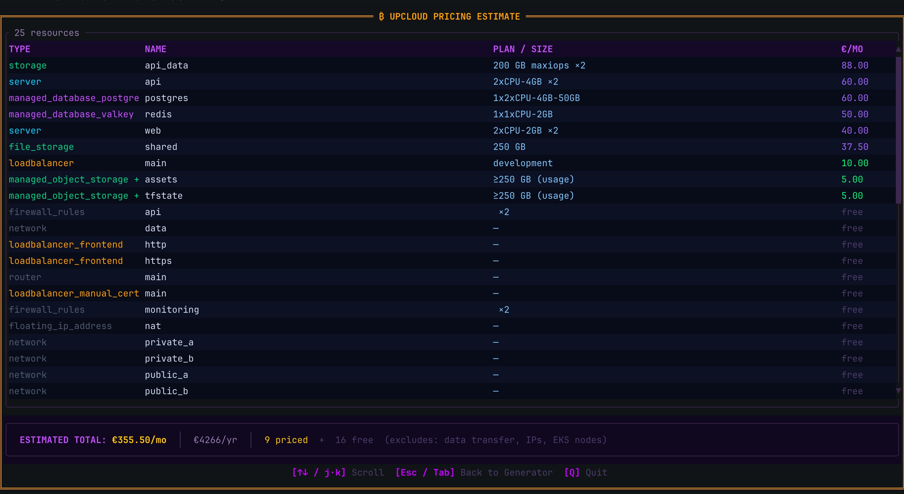
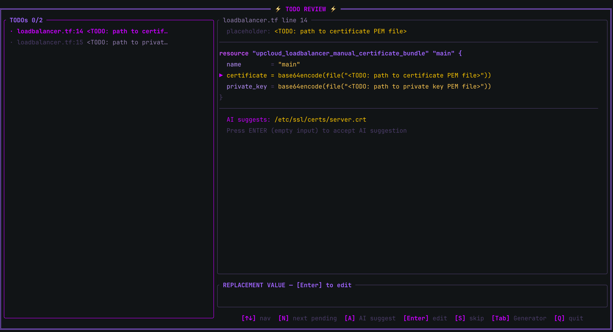

<a id="readme-top"></a>

[![Contributors][contributors-shield]][contributors-url]
[![Forks][forks-shield]][forks-url]
[![Stargazers][stars-shield]][stars-url]
[![Issues][issues-shield]][issues-url]
[![MIT License][license-shield]][license-url]

<br />
<div align="center">
<h3 align="center">upcloud-migrate</h3>
  <p align="center">
    A terminal tool that converts cloud infrastructure Terraform into UpCloud Terraform — automatically.
    <br />
    <br />
    <a href="https://github.com/OscarGTH/upcloud-migrator/issues/new?labels=bug">Report Bug</a>
    &middot;
    <a href="https://github.com/OscarGTH/upcloud-migrator/issues/new?labels=enhancement">Request Feature</a>
  </p>
</div>

<details>
  <summary>Table of Contents</summary>
  <ol>
    <li><a href="#about">About</a></li>
    <li>
      <a href="#install">Install</a>
      <ul>
        <li><a href="#pre-built-binaries">Pre-built binaries</a></li>
        <li><a href="#build-from-source">Build from source</a></li>
      </ul>
    </li>
    <li><a href="#quick-start">Quick start</a></li>
    <li><a href="#supported-providers">Supported providers</a></li>
    <li><a href="#adding-a-new-provider">Adding a new provider</a></li>
    <li><a href="#key-behaviours">Key behaviours</a></li>
    <li><a href="#environment-variables">Environment variables</a></li>
    <li><a href="#what-it-wont-do">What it won't do</a></li>
    <li><a href="#contributing">Contributing</a></li>
    <li><a href="#license">License</a></li>
  </ol>
</details>

---

## About

Point it at an existing Terraform project and it maps every resource, resolves cross-references, generates valid UpCloud HCL, and flags everything that needs manual review.

<table>
  <tr>
    <td width="50%"></td>
    <td width="50%"></td>
  </tr>
  <tr>
    <td width="50%"></td>
    <td width="50%"></td>
  </tr>
</table>

**Built with**

[![Rust][rust-shield]][rust-url]
[![Ratatui][ratatui-shield]][ratatui-url]
[![Tokio][tokio-shield]][tokio-url]

<p align="right">(<a href="#readme-top">back to top</a>)</p>

---

## Install

### Pre-built binaries

Download the latest release from [Releases][releases-url] — binaries are available for:

- `x86_64-unknown-linux-gnu` (Linux x64)
- `aarch64-apple-darwin` (macOS Apple Silicon)
- `x86_64-apple-darwin` (macOS Intel)

### Build from source

Requires Rust 1.85+ (edition 2024).

```bash
cargo build --release
./target/release/upcloud-migrate
```

<p align="right">(<a href="#readme-top">back to top</a>)</p>

---

## Quick start

```bash
upcloud-migrate
```

The TUI walks you through four steps:

1. **Path** — enter the directory containing your `.tf` files (or press `F` to browse)
2. **Scan** — discovers and parses all Terraform files
3. **Resources** — browse every mapped resource with a live HCL preview
4. **Generate** — pick an UpCloud zone and output directory; writes ready-to-review `.tf` files

After generation, press:

- **`D`** — diff every resource side-by-side (source on the left, UpCloud on the right)
- **`T`** — review `<TODO>` markers with AI-suggested completions
- **`C`** — ask the AI advisor about your migration
- **`P`** — view estimated pricing

### Try the demo

```bash
# Run the tool and enter this path when prompted:
demo/
```

The `demo/` directory contains a realistic SaaS setup: web + API servers, PostgreSQL, Redis, an Application Load Balancer with TLS, S3 buckets, and a shared EFS filesystem.

<p align="right">(<a href="#readme-top">back to top</a>)</p>

---

## Supported providers

### AWS → UpCloud

#### Compute

| AWS resource | UpCloud equivalent |
|---|---|
| `aws_instance` | `upcloud_server` |
| `aws_key_pair` | `login {}` block in `upcloud_server` |
| `aws_launch_template` | `upcloud_server` snippet |
| `variable` / `output` / `locals` | passed through with refs rewritten |

#### Network

| AWS resource | UpCloud equivalent |
|---|---|
| `aws_vpc` | `upcloud_router` |
| `aws_subnet` | `upcloud_network` |
| `aws_security_group` | `upcloud_firewall_rules` |
| `aws_vpc_security_group_ingress_rule` | `firewall_rule` block snippet |
| `aws_vpc_security_group_egress_rule` | `firewall_rule` block snippet |
| `aws_network_interface` | `network_interface {}` block in `upcloud_server` |
| `aws_internet_gateway` | *(not needed — UpCloud networks have public routing by default)* |
| `aws_nat_gateway` | *(not needed)* |
| `aws_route_table` / `aws_route_table_association` | `static_route` in `upcloud_router` |
| `aws_eip` | `upcloud_floating_ip_address` |
| `aws_eip_association` | `mac_address` snippet for floating IP |

#### Storage

| AWS resource | UpCloud equivalent |
|---|---|
| `aws_ebs_volume` | `upcloud_storage` |
| `aws_volume_attachment` | `storage_devices {}` block in server |
| `aws_ebs_snapshot` / `aws_ebs_snapshot_copy` | `upcloud_storage_backup` |
| `aws_db_snapshot` / `aws_db_cluster_snapshot` | *(informational — UpCloud managed DBs include automatic backups)* |
| `aws_s3_bucket` | `upcloud_object_storage` |
| `aws_s3_bucket_policy` / `aws_s3_bucket_acl` | *(informational — use UpCloud access keys and policies)* |
| `aws_efs_file_system` | `upcloud_file_storage` |

#### Load balancers

| AWS resource | UpCloud equivalent |
|---|---|
| `aws_lb` / `aws_alb` | `upcloud_loadbalancer` |
| `aws_lb_target_group` / `aws_alb_target_group` | `upcloud_loadbalancer_backend` |
| `aws_lb_listener` / `aws_alb_listener` | `upcloud_loadbalancer_frontend` |
| `aws_lb_target_group_attachment` / `aws_alb_target_group_attachment` | `upcloud_loadbalancer_static_backend_member` |
| `aws_acm_certificate` | `upcloud_loadbalancer_manual_certificate_bundle` |

#### Databases & caches

| AWS resource | UpCloud equivalent |
|---|---|
| `aws_db_instance` / `aws_rds_instance` | `upcloud_managed_database_postgresql` / `_mysql` |
| `aws_rds_cluster` | `upcloud_managed_database_postgresql` / `_mysql` |
| `aws_db_parameter_group` | `properties {}` block injection |
| `aws_db_subnet_group` | *(informational — network configured on the managed DB resource)* |
| `aws_elasticache_cluster` / `aws_elasticache_replication_group` | `upcloud_managed_database_valkey` |
| `aws_elasticache_subnet_group` | *(informational)* |
| `aws_elasticache_parameter_group` | *(informational)* |

#### Kubernetes

| AWS resource | UpCloud equivalent |
|---|---|
| `aws_eks_cluster` | `upcloud_kubernetes_cluster` |
| `aws_eks_node_group` | `upcloud_kubernetes_node_group` |
| `aws_eks_fargate_profile` | *(unsupported — UpCloud k8s uses node groups only)* |
| `aws_eks_addon` | *(unsupported — configure add-ons via kubectl/Helm)* |

#### Recognized but unsupported

These resource types are detected and documented in the generated `MIGRATION_NOTES.md`, but have no UpCloud equivalent:

`aws_autoscaling_group`, `aws_launch_configuration`, `aws_iam_*`, `aws_lambda_*`, `aws_cloudfront_*`, `aws_sqs_*`, `aws_sns_*`, `aws_api_gateway_*`, `aws_apigatewayv2_*`, `aws_cognito_*`, `aws_cloudwatch_*`, `aws_route53_*`

<p align="right">(<a href="#readme-top">back to top</a>)</p>

---

## Adding a new provider

The codebase uses a provider abstraction that makes adding GCP, Azure, or any other source straightforward. Each provider lives in its own module under `src/migration/providers/`.

### 1. Create the provider module

```
src/migration/providers/azure/
├── mod.rs           # SourceProvider trait impl
├── mapper.rs        # ResourceMapper trait impl
├── compute.rs       # VM / container mapping
├── network.rs       # VNet / subnet mapping
├── database.rs      # Database mapping
├── storage.rs       # Storage mapping
└── var_detector.rs  # Variable rewriting rules
```

### 2. Implement `SourceProvider`

The `SourceProvider` trait (in `src/migration/providers/mod.rs`) defines how the generator interacts with source resources:

```rust
pub struct AzureSourceProvider;

impl SourceProvider for AzureSourceProvider {
    fn display_name(&self) -> &str { "Azure" }
    fn resource_type_prefix(&self) -> &str { "azurerm_" }
    fn resource_role(&self, resource_type: &str) -> ResourceRole {
        match resource_type {
            "azurerm_virtual_machine" => ResourceRole::ComputeInstance,
            // ... map each resource type to its role
            _ => ResourceRole::Other,
        }
    }
    // ... implement the remaining extraction methods
}
```

### 3. Implement `ResourceMapper`

The `ResourceMapper` trait (in `src/migration/mapper.rs`) converts individual resources:

```rust
impl ResourceMapper for AzureMapper {
    fn map(&self, res: &TerraformResource) -> MigrationResult {
        match res.resource_type.as_str() {
            "azurerm_virtual_machine" => map_vm(res),
            "azurerm_virtual_network" => map_vnet(res),
            // ...
            _ => MigrationResult::unsupported(res),
        }
    }
}
```

### 4. Register the provider

Add the detection logic in `src/migration/providers/mod.rs` so resources with the new prefix are routed to your provider, and wire it into `src/migration/mapper.rs`.

That's it — the generator, cross-reference resolver, diff view, and TODO system all work provider-agnostically.

<p align="right">(<a href="#readme-top">back to top</a>)</p>

---

## Key behaviours

- **Cross-reference resolution** — `server_id`, `network`, `loadbalancer`, and `backend` references are resolved where the mapping is unambiguous. Ambiguous references get a `<TODO>`.
- **Variable passthrough** — `variable`, `output`, and `locals` are carried through. Provider-specific defaults (instance types, region strings) are converted to their UpCloud equivalents; region/location variables become the zone you selected.
- **HCL validation** — each generated file is validated with `hcl::from_str` after writing.
- **AWS: Security group merging** — AWS allows multiple security groups per instance; UpCloud allows one `upcloud_firewall_rules` per server. The generator merges and deduplicates all attached SGs automatically.

<p align="right">(<a href="#readme-top">back to top</a>)</p>

---

## Environment variables

| Variable | Purpose |
|---|---|
| `LLM_API_KEY` | API key for AI-powered TODO suggestions and chat |
| `LLM_API_URL` | API endpoint URL |
| `LLM_MODEL` | Model name |

<p align="right">(<a href="#readme-top">back to top</a>)</p>

---

## What it won't do

The output is a **starting point**, not a drop-in replacement. Things that always need manual review:

- **OS template** — servers default to `"Ubuntu Server 24.04 LTS"`; update to match your actual image
- **SSH keys** — servers without a linked key-pair resource need public keys added manually
- **TLS certificates** — managed certificate services (e.g. ACM) don't export private keys; export and supply them manually
- **Unsupported resources** — anything with no UpCloud equivalent is listed in the generated `MIGRATION_NOTES.md`

<p align="right">(<a href="#readme-top">back to top</a>)</p>

---

## Contributing

Contributions are welcome! If you have a suggestion or want to add support for a new provider, please open an issue or submit a pull request.

1. Fork the project
2. Activate the commit-message hook (one-time setup):
   ```bash
   git config core.hooksPath .githooks
   ```
3. Create your feature branch (`git checkout -b feature/azure-provider`)
4. Commit your changes using [conventional commits](https://www.conventionalcommits.org/) (`git commit -m 'feat: add Azure provider'`)
5. Push to the branch (`git push origin feature/azure-provider`)
6. Open a pull request

<p align="right">(<a href="#readme-top">back to top</a>)</p>

---

## License

Distributed under the MIT License. See `LICENSE` for more information.

<p align="right">(<a href="#readme-top">back to top</a>)</p>

---

<!-- MARKDOWN LINKS & IMAGES -->
[contributors-shield]: https://img.shields.io/github/contributors/OscarGTH/upcloud-migrator.svg?style=for-the-badge
[contributors-url]: https://github.com/OscarGTH/upcloud-migrator/graphs/contributors
[forks-shield]: https://img.shields.io/github/forks/OscarGTH/upcloud-migrator.svg?style=for-the-badge
[forks-url]: https://github.com/OscarGTH/upcloud-migrator/network/members
[stars-shield]: https://img.shields.io/github/stars/OscarGTH/upcloud-migrator.svg?style=for-the-badge
[stars-url]: https://github.com/OscarGTH/upcloud-migrator/stargazers
[issues-shield]: https://img.shields.io/github/issues/OscarGTH/upcloud-migrator.svg?style=for-the-badge
[issues-url]: https://github.com/OscarGTH/upcloud-migrator/issues
[license-shield]: https://img.shields.io/github/license/OscarGTH/upcloud-migrator.svg?style=for-the-badge
[license-url]: https://github.com/OscarGTH/upcloud-migrator/blob/main/LICENSE
[releases-url]: https://github.com/OscarGTH/upcloud-migrator/releases
[rust-shield]: https://img.shields.io/badge/Rust-000000?style=for-the-badge&logo=rust&logoColor=white
[rust-url]: https://www.rust-lang.org/
[ratatui-shield]: https://img.shields.io/badge/ratatui-1e1e2e?style=for-the-badge&logo=rust&logoColor=cdd6f4
[ratatui-url]: https://ratatui.rs/
[tokio-shield]: https://img.shields.io/badge/tokio-000000?style=for-the-badge&logo=rust&logoColor=white
[tokio-url]: https://tokio.rs/
